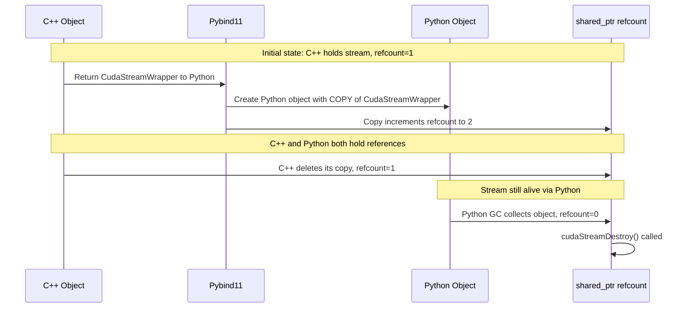
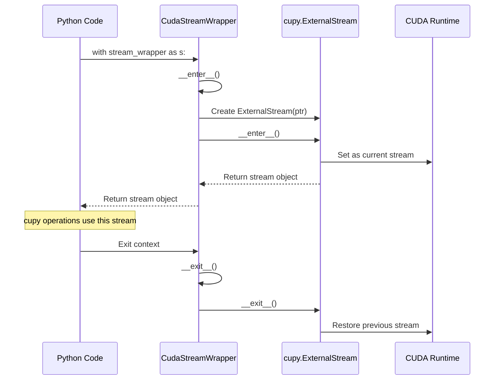

# CudaStreamWrapper Pybind11 Bindings

## Objective

Implement pybind11 bindings for `CudaStreamWrapper` that enable Python code to:
1. Receive CUDA streams from C++ objects
2. Use them directly with cupy via Python's context manager protocol
3. Ensure proper reference counting so streams remain valid while Python holds references

**Target Python syntax:**
```python
import cupy as cp
import ksgpu

# Get stream from C++ object and use directly with context manager
with some_cpp_object.get_stream() as s:
    arr = cp.zeros(100)  # Operations use the C++ stream
    result = cp.sum(arr)
```

The implementation must guarantee that:
- Python owns a reference to the stream (via `shared_ptr` copy)
- The stream stays alive as long as Python holds a reference
- The stream is properly destroyed when all references are released

---

## Overview

Implement pybind11 bindings for `CudaStreamWrapper` that:
1. Allow C++ code to return streams to Python
2. Properly manage reference counting so streams stay alive
3. **Support Python's `with` statement for direct cupy interop**

## How Reference Counting Works

The `CudaStreamWrapper` class uses `std::shared_ptr<CUstream_st>` internally:

```cpp
class CudaStreamWrapper {
public:
    std::shared_ptr<CUstream_st> p;  // Reference-counted stream handle
};
```

When we register this class with pybind11 using `py::class_<CudaStreamWrapper>`:



**Key insight**: Pybind11 creates a *copy* of the `CudaStreamWrapper` inside the Python object. Since `CudaStreamWrapper` contains a `shared_ptr`, this copy increments the reference count. When Python's garbage collector destroys the Python object, the copy's destructor runs, decrementing the refcount.

## Implementation

### 1. Register CudaStreamWrapper with Context Manager Support

In `ksgpu/src_pybind11/ksgpu_pybind11.cpp`, use `py::dynamic_attr()` to allow storing the temporary `ExternalStream`:

```cpp
py::class_<CudaStreamWrapper>(m, "CudaStreamWrapper", py::dynamic_attr(),
    "RAII wrapper for cudaStream_t with reference counting.\n"
    "Supports context manager protocol for cupy interop:\n"
    "    with stream_wrapper as s:\n"
    "        arr = cupy.zeros(100)  # uses this stream")
    .def(py::init<>(), "Create wrapper for default stream (ptr=0)")
    .def_static("create", &CudaStreamWrapper::create,
        "Create a new CUDA stream", py::arg("priority") = 0)
    .def_property_readonly("ptr", [](const CudaStreamWrapper &s) {
        return reinterpret_cast<uintptr_t>(s.p.get());
    }, "Raw cudaStream_t pointer")
    .def_property_readonly("is_default", [](const CudaStreamWrapper &s) {
        return s.p.get() == nullptr;
    }, "True if this is the default stream")
    
    // Context manager: __enter__ creates ExternalStream and activates it
    .def("__enter__", [](py::object self) {
        py::module_ cupy = py::module_::import("cupy");
        auto &wrapper = self.cast<CudaStreamWrapper &>();
        uintptr_t ptr = reinterpret_cast<uintptr_t>(wrapper.p.get());
        py::object ext_stream = cupy.attr("cuda").attr("ExternalStream")(ptr);
        py::object result = ext_stream.attr("__enter__")();
        self.attr("_ext_stream") = ext_stream;  // Store for __exit__
        return result;
    })
    
    // Context manager: __exit__ deactivates the stream
    .def("__exit__", [](py::object self, py::object exc_type, py::object exc_val, py::object exc_tb) {
        py::object ext_stream = self.attr("_ext_stream");
        py::object result = ext_stream.attr("__exit__")(exc_type, exc_val, exc_tb);
        self.attr("_ext_stream") = py::none();  // Clean up
        return result;
    })
    
    .def("__repr__", [](const CudaStreamWrapper &s) {
        std::stringstream ss;
        ss << "CudaStreamWrapper(ptr=0x" << std::hex 
           << reinterpret_cast<uintptr_t>(s.p.get()) << ")";
        return ss.str();
    })
;
```

### 2. How Context Manager Works



### 3. Test Helper Class for Refcount Testing

```cpp
struct StreamHolder {
    CudaStreamWrapper stream;
    
    StreamHolder() : stream(CudaStreamWrapper::create()) {
        std::cout << "StreamHolder created, stream ptr=" 
                  << reinterpret_cast<uintptr_t>(stream.p.get()) << std::endl;
    }
    
    ~StreamHolder() {
        std::cout << "StreamHolder destroyed" << std::endl;
    }
    
    CudaStreamWrapper get_stream() { return stream; }
};
```

### 4. Export in tests.py

```python
from .ksgpu_pybind11 import CudaStreamWrapper, StreamHolder
```

## Unit Tests

### Test 1: Basic functionality

```python
def test_stream_wrapper_basic():
    """Test basic CudaStreamWrapper creation and properties."""
    # Default stream
    default_stream = ksgpu.CudaStreamWrapper()
    assert default_stream.ptr == 0
    assert default_stream.is_default
    
    # New stream
    stream = ksgpu.CudaStreamWrapper.create()
    assert stream.ptr != 0
    assert not stream.is_default
```

### Test 2: Context manager with cupy

```python
def test_stream_wrapper_context_manager():
    """Test that CudaStreamWrapper works as context manager."""
    import cupy as cp
    
    stream = ksgpu.CudaStreamWrapper.create()
    
    # Direct context manager usage!
    with stream as s:
        a = cp.arange(1000)
        b = a * 2
    
    # Verify computation worked
    assert int(b[500].get()) == 1000
```

### Test 3: Reference counting with StreamHolder

```python
def test_stream_wrapper_refcount():
    """Test that Python properly owns a reference to the stream."""
    import gc
    import cupy as cp
    
    # Create holder, get stream, delete holder
    holder = ksgpu.StreamHolder()
    stream = holder.get_stream()
    original_ptr = stream.ptr
    
    # Delete the C++ holder
    del holder
    gc.collect()
    
    # Stream should still be valid (Python holds reference)
    assert stream.ptr == original_ptr
    
    # Use stream with context manager to verify it's actually valid
    with stream as s:
        arr = cp.zeros(10)
        cp.cuda.runtime.deviceSynchronize()
    
    # Now delete Python reference
    del stream
    gc.collect()
    # Stream is now destroyed (no crash = success)
```

### Test 4: Context manager from C++ object method

```python
def test_stream_from_cpp_object():
    """Test the target use case: getting stream from C++ object."""
    import cupy as cp
    
    holder = ksgpu.StreamHolder()
    
    # This is the desired syntax!
    with holder.get_stream() as s:
        a = cp.arange(100)
        b = a + 1
    
    assert int(b[50].get()) == 51
```

### Test 5: Multiple references

```python
def test_stream_wrapper_multiple_refs():
    """Test that multiple Python references work correctly."""
    import gc
    
    stream1 = ksgpu.CudaStreamWrapper.create()
    stream2 = stream1  # Both point to same stream
    
    assert stream1.ptr == stream2.ptr
    
    del stream1
    gc.collect()
    
    # stream2 should still be valid
    assert stream2.ptr != 0
```

## Files to Modify/Create

| File | Changes |
|------|---------|
| `ksgpu/src_pybind11/ksgpu_pybind11.cpp` | Add CudaStreamWrapper binding with context manager, StreamHolder |
| `ksgpu/ksgpu/tests.py` | Export CudaStreamWrapper, StreamHolder |
| `ksgpu/test_array_conversion.py` | Add stream wrapper tests |

## Summary

The context manager support is implemented by:

1. **`py::dynamic_attr()`**: Allows the Python object to store arbitrary attributes (needed to store the temporary `ExternalStream`)

2. **`__enter__`**: Creates a `cupy.cuda.ExternalStream` from the pointer, calls its `__enter__()` (which makes it the current stream), and stores it in `self._ext_stream`

3. **`__exit__`**: Retrieves the stored `ExternalStream` and calls its `__exit__()` (which restores the previous stream)

This enables the clean syntax:
```python
with some_cpp_object.get_stream() as s:
    arr = cp.zeros(100)  # Uses the C++ stream
```

**Reference counting guarantee**: Pybind11's copy semantics ensure that when a `CudaStreamWrapper` is returned to Python, the `shared_ptr` is copied (incrementing the refcount). The stream remains valid until all Python and C++ references are released, at which point `cudaStreamDestroy()` is automatically called.

